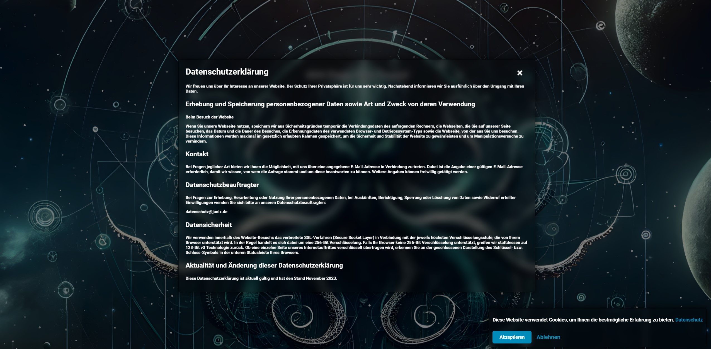
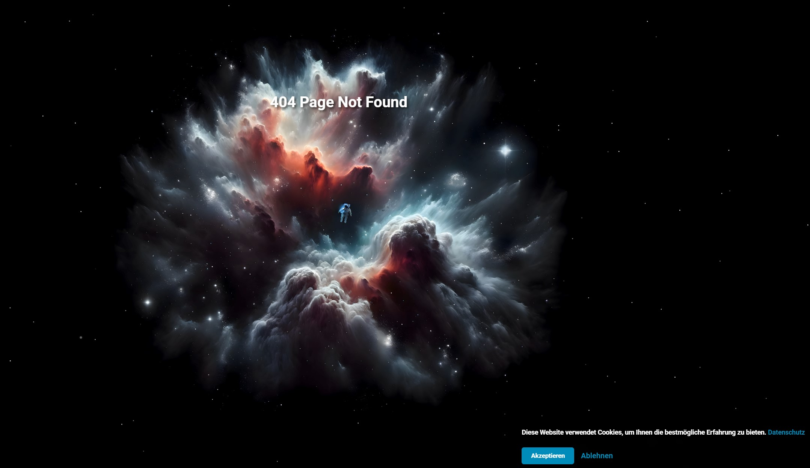

# Error Page Project

Dieses Repository enthält eine benutzerdefinierte Error-Seite, die mit Animationseffekten von `tsparticles` gestaltet ist.

Die Bilder sind mit ChatGPT DALL-E erstellt wurden und können frei verwendet werden. :) viel Spaß!

[Demo Seite](https://404.syscgn.de/)
[Demo Seite](https://dariofazio.de/)

## Screenshots






## Verwendung

Sie können diese Error-Seite frei in Ihren Projekten verwenden. Bitte beachten Sie, dass die Animationen durch `tsparticles` bereitgestellt werden und deren Lizenzbedingungen beachtet werden müssen. Informationen zu `tsparticles` und den zugehörigen Lizenzbedingungen finden Sie hier: [tsParticles GitHub Repository](https://github.com/matteobruni/tsparticles).

## Installation

Klonen Sie dieses Repository, um die Error-Seite in Ihre Anwendung zu integrieren.

```bash
git clone https://github.com/Warex2020/404PageNotFound.git
